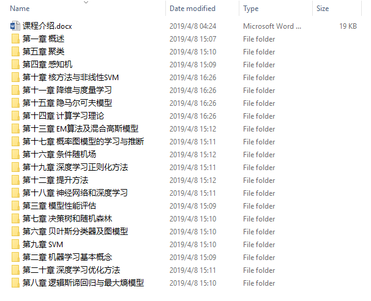
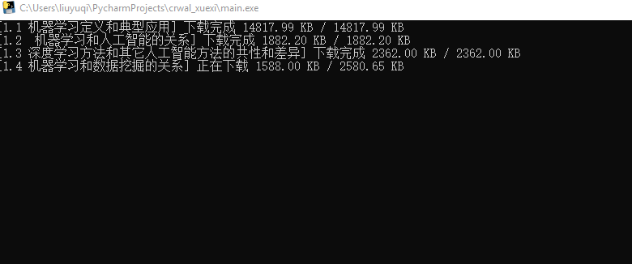

## crawl_xuexi

下载 学习强国 www.xuexi.cn 上面的机器学习课程.注意,该网站所有文章的内容存在 dataxxx.js 中.《大数据机器学习》视频链接:

https://www.xuexi.cn/9f584b49d8a7386a4cf248ce16f5e667/9b0f04ec6509904be734f5f609a3604a.html

《大数据机器学习》课程百度云分享:

链接：https://pan.baidu.com/s/1U8Nu4ZStfpQfuCnaoXmWIg
提取码：3b3s

由于"学习强国APP"上视频采用cdn分发,而百度云下载限速,所以建议直接用本项目程序下载视频,方便,迅速.

### 初衷
写这个项目的初衷是,目前机器学习对我国前途命运很重要,网络上这类课程大都收费,斯坦福机器学习,吴恩达课程等都是英文授课.而学习强国上却免费提供清华大学机器学习课程,可以直接学习了.

**我个人看教程视频喜欢加速看,一般1.5倍加速看,在网上看着实累人.所以想到直接下载视频咯**.此外,这个项目更改下链接,还可以下载其他教程视频.所以分享给大家.

### 介绍

1. 视频列表js整理为ml.json
2. 对ml.json中每条抓包过滤 dataxxx.js ,获取视频链接
3. 异步分 5 线程队列下载视频 .

### 使用
1. 到 https://github.com/jianboy/crawl_xuexi/releases 下载 crwal_xuexi.zip 可执行文件.

2. 双击打开 crwal_xuexi.exe 执行程序。

3. 输入需要下载的“学习慕课”栏目某课程.视频自动下载到 Video 文件夹

**举例：**

下载机器学习视频，输入视频链接：

### 更新历史

已实现多线程下载 .

已实现“学习强国APP”下**任意**的“学习慕课”栏目视频下载.

### 版权说明

本项目开源,免费使用,无任何限制,下载的课件视频建议个人使用,请勿以盈利性目的分发哦.

仅供技术交流,有关部门认清形势,请勿随意请喝茶,喝咖啡欢迎!